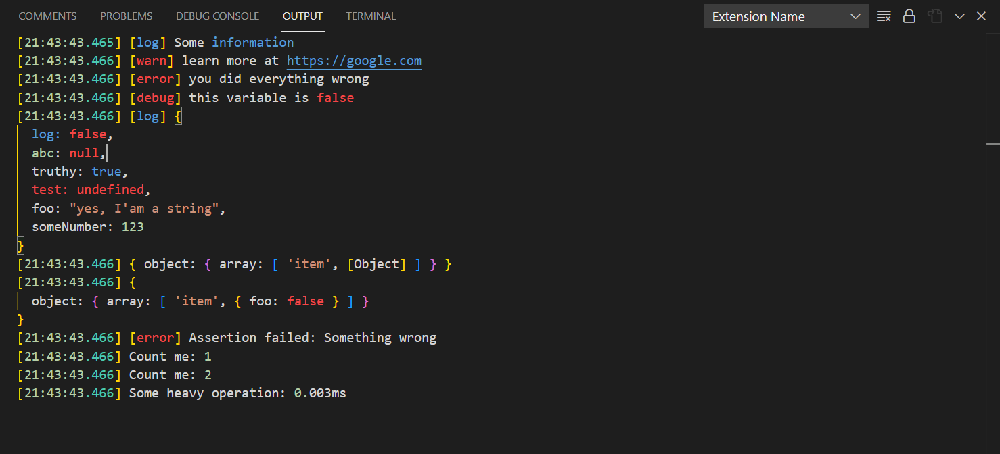

# Console

Status: almost done, for not it getting stripped by esbuild in produciton.
TODO: describe config variants

All console methods in your code by default will be redirected to Output channel of your extension. You literally don't need to everything.

## Example

Let's say you have `{"displayName": "Extension Name"}` in your manifest and `src/extension.ts`:

```ts
export const activate = () => {
    // just printing
    console.log('Some information')
    console.warn('learn more at https://google.com')
    console.error('you did everything wrong')
    // not printed in production by default
    console.debug('this variable is false')

    // printing objects
    console.log({ log: false, abc: null, truthy: true, test: undefined, foo: "yes, I'am a string", someNumber: 123 })
    console.dir({ object: { array: ['item', { foo: false }] } })
    console.dir({ object: { array: ['item', { foo: false }] } }, { depth: null })

    // just useful methods
    console.assert(false, 'Something wrong')
    console.count('Count me')
    console.count('Count me')
    console.time('Some heavy operation')
    console.timeEnd('Some heavy operation')
}
```



But note, that on this demo: Bracket Colorizer is on and Output Colorizer is installed (keep in mind, it conflicts with Code Runner).

Beware of `global.console`. Never use it, as it remains unchanged!
<!-- TODO check for it -->

## Notes

- I decided to make `console.info` special, as you can see above it doesn't print any markers (log, warn, error etc)
- `console.clear()` works as expected
- New methods: `console.show(focus = false)` and `console.hide()` to show and hide output channel respectively
- Others methods such as `profile` or `console.Console` remains untouched
- `group` and `groupEnd` are useless

However, what was said above applies only for Node.js.
For browser environments, there is no `console.Console` method, so it's not easy to redirect output.

## WEB Notes

!!! For now, this feature is not supported in browsers at all.

### Formatting

<!-- Though, it's a temporary limitation keep in mind, that when targeting browser environments, using such methods as `console.assert(false, ...)` will just literally kill your extension!
Using `console.log('%s there', 'hey')` simply won't work. However if don't use this feature and use only `log`, `debug`, `warn`, `error`, `debug`, `time`, `timeEnd` you are safe to go! -->

## Debug

As said above, `console.debug` is enabled only in development by default, but it's possible to enable by manually calling `vscode_framework_set_debug_enabled` anywhere in your code.

For example we can enable debug is appropriate setting is enabled:

```ts
import { getExtensionSetting } from 'vscode-framework'
import { vscode_framework_set_debug_enabled } from 'vscode-framework/build/framework/injected'

declare const vscode_framework_set_debug_enabled: vscode_framework_set_debug_enabled

export const activate = () => {
    vscode_framework_set_debug_enabled(getExtensionSetting('debug'))
}
```

TODO: append with command executed

## Advanced

This feature works by simply putting `console` variable to the top of your bundled script ([here is the code](../src/cli/esbuild/consoleInject.ts)). It means that other dependencies will use it too, but not other extensions.
Also, if you really need to access to the `vscode.OutputChannel` instance, you can do it like so: `VSCODE_FRAMEWORK_OUTPUT.channel` anywhere in your extension.
