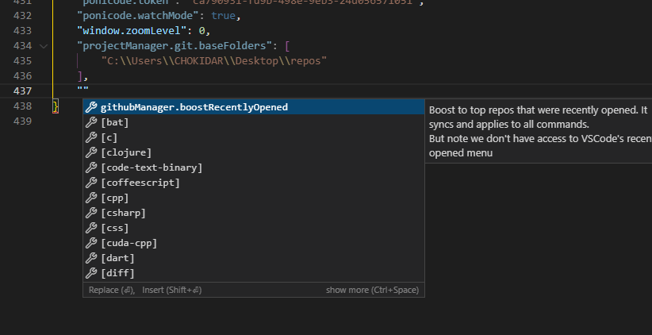

# Configuration

Basic documentation about configuration available at <https://code.visualstudio.com/api/references/contribution-points#contributes.configuration>. But let's extend it:

- never repeat yourself and put `title` into `configuration`, just leave as is
- normally you don't need to use (or even know about) `configurationDefaults`

## Linking to settings

Just use linking as you would normally use:

```json
{
    "enableSomeModule": {
        "type": "boolean",
        "default": false
    },
    "someModuleMode": {
        "type": "string",
        "markdownDescription": "Warning: this setting has an effect only when #enableSomeModule# is true.",
        "enum": ["modeA", "modeB"]
    }
}
```

You'll get warning if linked setting doesn't exist.

## Markdown in non-markdown Properties

To use markdown syntax, use need to prepend properties that support it with `markdown*`, e.g. `deprecationMessage` -> `markdownDeprecationMessage`.
If you don't do this, you'll receive warning, however you can set `config.contributions.markdownProperties` to `replace`, so vscode-framework will rename these properties for you.

## Other Useful Properties

Plus to properties that described in VSCode API's documentation, there are also properties good to know:

### `defaultSnippets`

More at [VSCode docs](https://code.visualstudio.com/docs/languages/json#_define-snippets-in-json-schemas). You can also define it in `patternProperties` and `additionalProperties`.

### `errorMessage`

Message that will be printed along with problem message. (e.g. incorrect type)

### `doNotSuggest`

When set to `true` suggestion item with this setting id won't appear when editing `settings.json`, have no effect in settings UI.

### `suggestSortText`

Almost the same as `vscode.CompletionItem.sortTest`. Most probably you don't need it, but as an example, if you set it to `!`, your setting will appear on top.



## TypeScript Typing as Configuration

> The feature is experimental, see limitations below

You must probably aware that JSON schema is used to define `configuration` (but with some additional fields), in simple cases you can continue to maintain the schema and typings will be generated for you. However, in case of large configurations you can save your time and use TypeScript type to maintain configuration instead.

### Switch to TypeScript

- **remove** `configuration` contribution from *package.json*
- create `src/configurationType.ts` with exported `Configuration` **type** (not interface!)
- use basic types as you always would:
  - primitives, arrays
  - objects: use `{[x: string]: ...}` and **not Record**

To specify JSON Schema-specific props, use [annotations](https://github.com/YousefED/typescript-json-schema#annotations)
You can also look at more examples and tests in [TJS Repository](https://github.com/YousefED/typescript-json-schema)

- remember to include `@default` annotations for top-level props and JSDoc description for every prop

- your `generated.ts` will now point to this settings type (that's why it must be exported)

### Advantages

- Less to write (schemas in types are shorter)
- Use comments and TODOs right where your configuration lives
- Much shorter and readable (thus maintainable) configuration
- Reuse types (enums, or string unions in type)

### It's Slow

The generation process of schema is extremely slow. It can take up to 10 seconds to generate schema. For now, to mitigate this, generated schema is cached and should also be committed.

### Other Known Limitations

- no migrate command
- object-map support
- no support for annotations for special props (`markdown*`)
- no warnings on unsupported annotations
- no TypeScript plugin for annotations
- no `typeof defaultConfig` strategy available
